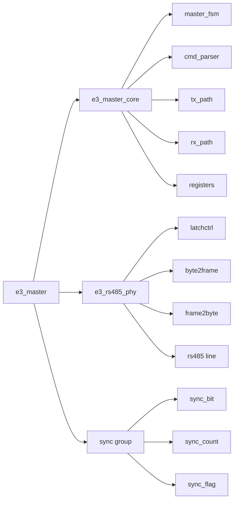
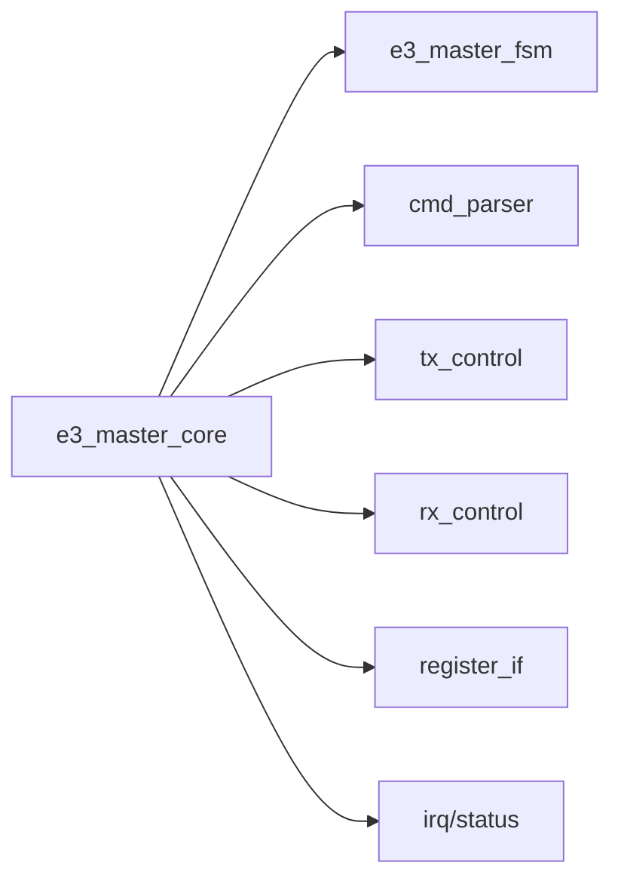
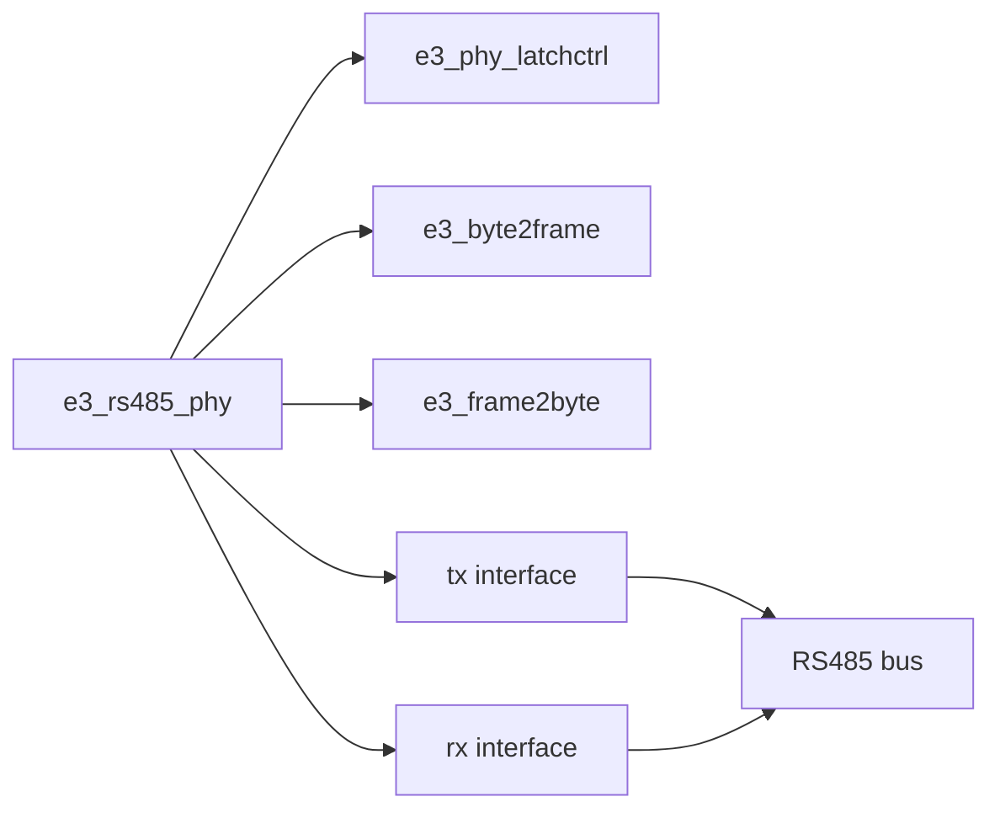
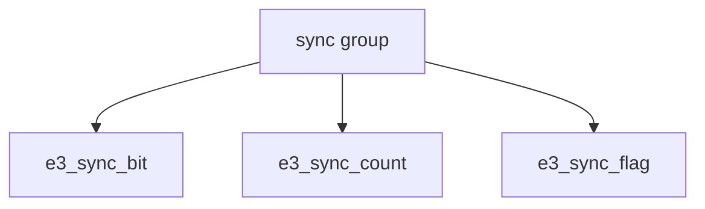

## E 3 Master 模块层次结构

本文档展示 `e3_master` 的模块层次、`e3_rs485_phy` 的内部组成，以及同步模块的关系。

---

## 1. 顶层总览



### 说明
- `e3_master`
  - 顶层模块
  - 主要由 `core`、`phy` 和 `sync group` 组成
- `e3_master_core`
  - 主控逻辑
  - 负责状态机、命令处理、收发调度、寄存器控制
- `e3_rs485_phy`
  - 物理层相关逻辑
  - 负责字节/帧处理以及锁存控制
- `sync group`
  - 同步相关模块集合
  - 用于跨时钟域或控制信号同步

---

## 2. e 3 _master_core 结构



### core 子模块说明
- `e3_master_fsm`
  - 主状态机
  - 协调发送、接收、异常与控制流程
- `cmd_parser`
  - 命令解析
  - 负责识别上层输入的控制命令或配置
- `tx_control`
  - 发送通路控制
  - 组织待发送数据并驱动 PHY
- `rx_control`
  - 接收通路控制
  - 对接收结果进行处理、缓存或上报
- `register_if`
  - 寄存器接口
  - 提供配置、状态读取和控制入口
- `irq/status`
  - 中断与状态
  - 管理事件标志、状态位和异常通知

---

## 3. e 3 _rs 485_ phy 内部结构



### phy 子模块说明
- `e3_phy_latchctrl`
  - 锁存控制
  - 控制 PHY 时序相关的锁存/采样行为
- `e3_byte2frame`
  - 字节转帧
  - 将发送字节组织为线路侧需要的帧格式
- `e3_frame2byte`
  - 帧转字节
  - 将接收到的帧还原成上层可处理的字节流
- `tx interface`
  - 发送接口
  - 连接内部发送逻辑与 RS 485 总线
- `rx interface`
  - 接收接口
  - 连接 RS 485 总线与内部接收逻辑
- `RS485 bus`
  - 外部物理通信总线

---

## 4. 同步模块关系



### 同步模块说明
- `e3_sync_bit`
  - 用于单 bit 控制信号同步
- `e3_sync_count`
  - 用于计数值或多 bit 数值同步
- `e3_sync_flag`
  - 用于脉冲、事件或标志位同步

### 可能涉及的同步信号
- `e3_sync_tx_rdy_i`
- `e3_sync_enable_i`
- `e3_sync_tx_ack_i`
- `e3_sync_tx_abort_i`
- `e3_sync_rx_abort_i`

---

## 5. 简化层次树

```text
e3_master
├─ e3_master_core
│  ├─ e3_master_fsm
│  ├─ cmd_parser
│  ├─ tx_control
│  ├─ rx_control
│  ├─ register_if
│  └─ irq/status
├─ e3_rs485_phy
│  ├─ e3_phy_latchctrl
│  ├─ e3_byte2frame
│  ├─ e3_frame2byte
│  ├─ tx interface
│  └─ rx interface
└─ sync group
   ├─ e3_sync_bit
   ├─ e3_sync_count
   └─ e3_sync_flag
```

---

## 6. 模块职责表

| 模块 | 作用 |
| --- | --- |
| `e3_master` | 顶层控制模块 |
| `e3_master_core` | 主控与状态调度 |
| `e3_rs485_phy` | RS 485 物理层处理 |
| `e3_master_fsm` | 核心状态机 |
| `e3_byte2frame` | 发送字节转帧 |
| `e3_frame2byte` | 接收帧转字节 |
| `e3_phy_latchctrl` | 采样/锁存控制 |
| `e3_sync_bit` | 单 bit 信号同步 |
| `e3_sync_count` | 计数值同步 |
| `e3_sync_flag` | 事件/标志同步 |

如果你愿意，我下一步可以继续帮你把这份内容整理成：
- 更贴近 RTL 的真实实例名版本
- 带信号流向的版本
- 带端口说明表的版本